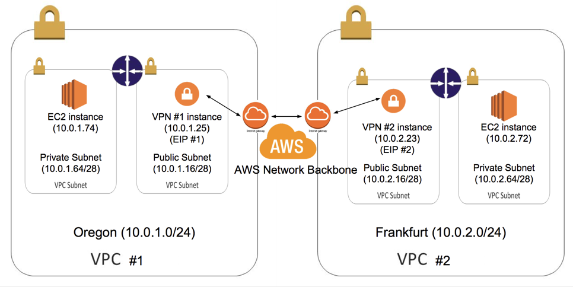

# vpn-vpcs
AWS cross-region VPC to VPC connection by SSH tunnel

## Example VPC Setup

This guide will use the following VPC configuration for illustrative purposes:




## To launch Amazon EC2 VPN instances

1. Launch two Amazon Linux instances, one in each VPC public subnet, with the following characteristics:
  1. Allocate two VPC EIPs and associate an EIP to each VPN instance.
* Disable Source/Dest checking on both instances by right-clicking on the instances and selecting Change Source/Dest. Check.  
* Configure Routing Tables in both VPCs to send traffic to the "other" VPC through the VPC EC2 instances.  

## To configure sshd config on Amazon EC2 instances
1. Connect to each EC2 VPN Instance and su as root  
  ```  
  Prompt> sudo su -  
  
  ```  
* Generate ssh key pair for root  
  ```  
  Prompt> ssh-keygen  
  
  ```  
* Add public key of other VPN instance to /root/.ssh/authorized_keys
* Edit the /etc/ssh/sshd_config file and make sure following options are yes  
  ```  
  Prompt> vi /etc/ssh/sshd_config  
  
  ```  
  ```  
  PermitTunnel yes  
  PermitRootLogin yes  
  
  ```  

## Download and configure the vpn.sh script
1. Connect to VPC #1 VPN Instance and su as root  
  ```  
  Prompt> sudo su -  
  
  ```  
* download the vpn.sh script and make it executable  
  ```   
  Prompt> cd /root  
  Prompt> wget https://raw.githubusercontent.com/eric6239/vpn-vpcs/master/vpn.sh  
  Prompt> chmod +x vpn.sh
  
  ```
* Edit the following variables to match your settings  
  - **LOCAL_NET** - VPC #1 CIDR (10.0.1.0/24 for this example)
  - **REMOTE_NET** - VPC #2 CIDR (10.0.2.0/24 for this example)
  - **REMOTE_EIP** - EIP #2
* Configure vpn.sh to be started by cron at boot  
  ```
  Prompt> echo '@reboot /root/vpn.sh >> /var/log/vpn.log' | crontab
  
  ```

## Reboot EC2 VPN Instance
1. Connect to each EC2 VPN Instance
  ```  
  Prompt> sudo reboot
  
  ```  

## Test VPN status
1. Connect to VPC #1 VPN Instance and ping VPC #2 VPN Instance
  ```  
  Prompt> ping 10.0.2.23
  
  ```  

## Appendix: High availability AWS VPC to VPC cross-region VPN by SSH tunnel 
Creating a fully redundant VPC connection between VPCs in two regions requires the setup and configuration of four VPN instances.  
Please refer to: https://github.com/eric6239/ha-vpn-vpcs


## Reference

- <a href="https://aws.amazon.com/articles/5472675506466066" target="_blank">Connecting Multiple VPCs with EC2 Instances (IPSec)</a>


## License

Copyright (c) 2016 Eric Chang

Licensed under the [MIT License](LICENSE).
